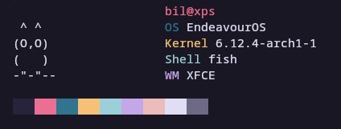

<div align="center">
	<h1>birdfetch</h1>
	<blockquote align="center">🐦 A very quick command-line system information tool written in Rust.</blockquote>
	<p>
		<a href="https://github.com/bilerden/birdfetch/blob/master/LICENSE">
			
		</a>
		<a href="https://github.com/bilerden/birdfetch/stargazers">
			
		</a>
		<br>
		birdfetch is a <code>neofetch-like</code> applet.
		The idea is a Rust 🦀 implementation of <a href="https://github.com/Rosettea/bunnyfetch">Bunnyfetch</a> which itself is inspired by <a href="https://github.com/elenapan/dotfiles/blob/master/bin/bunnyfetch">Elena Pan's dotfiles</a>.
	</p><br>
	
</div>

# Install
You can just run `cargo install --git https://github.com/bilerden/birdfetch` or if you prefer a [binary, here you go](https://github.com/bilerden/birdfetch).

## Compile
```sh
bash ./setup.sh
```  

or you can do it yourself:

```sh
curl --proto '=https' --tlsv1.2 -sSf https://sh.rustup.rs | sh
git clone https://github.com/bilerden/birdfetch
cd birdfetch
cargo build --release
```

# Usage
Just run `birdfetch`!

# License
birdfetch is licensed under the [MIT license](LICENSE).